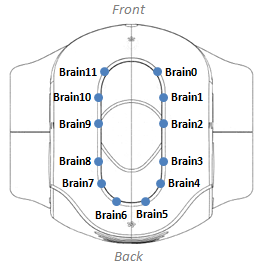

.. _leds:

Leds
####

Tutorials
*********

Set blue led intensity
======================

To set the intensity of :ref:`blue_leds`:

.. code-block:: cpp

    // Set led L0 in left ear to intensity 1.0
    nao_interfaces::msg::LeftEarLeds left_ear_leds;
    left_ear_leds.intensities[nao_interfaces::msg::LeftEarLeds::L0] = 1.0;

Set color of RGB led
====================

.. code-block:: cpp

    // Set red led in L0 of left eye to intensity 1.0
    nao_interfaces::msg::LeftEyeLeds eye_leds;
    eye_leds.colors[nao_interfaces::msg::LeftEyeLeds::L0].r = 1.0;

Set color across all leds
=========================

To populate all LEDs to be a certain color, you can iterate over NUM_LEDS, in the corresponding msgs.

.. code-block:: cpp

    // Set all leds to yellow in right eye
    nao_interfaces::msg::RightEyeLeds right_eye_leds;

    std_msgs/ColorRGBA yellow;
    yellow.r = 1.0;
    yellow.g = 1.0;

    for (unsigned i = 0; i < nao_interfaces::msg::RightEyeLeds::NUM_LEDS; ++i)
    {
      right_eye_leds.colors[i] = yellow;
    }

LED Indexes
***********

.. _head_leds:

Head Leds
=========

The following list is from ``HeadLeds.msg``:

.. code-block:: python

    int32 B0=0
    int32 B1=1
    int32 B2=2
    int32 B3=3
    int32 B4=4
    int32 B5=5
    int32 B6=6
    int32 B7=7
    int32 B8=8
    int32 B9=9
    int32 B10=10
    int32 B11=11
    int32 NUM_LEDS=12

.. _left_ear_leds:

Left Ear Leds
=============

The following list is from ``LeftEarLeds.msg``:

.. code-block:: python

    int32 L0=0
    int32 L1=1
    int32 L2=2
    int32 L3=3
    int32 L4=4
    int32 L5=5
    int32 L6=6
    int32 L7=7
    int32 L8=8
    int32 L9=9
    int32 NUM_LEDS=10

.. _right_ear_leds:

Right Ear Leds
==============

.. image:: images/right_ear_leds.png

The following list is from ``RightEarLeds.msg``:

.. code-block:: python

    int32 R0=0
    int32 R1=1
    int32 R2=2
    int32 R3=3
    int32 R4=4
    int32 R5=5
    int32 R6=6
    int32 R7=7
    int32 R8=8
    int32 R9=9
    int32 NUM_LEDS=10

.. _left_eye_leds:

Left Eye Leds
=============

The following list is from ``LeftEyeLeds.msg``:

.. code-block:: python

    int32 L0=0
    int32 L1=1
    int32 L2=2
    int32 L3=3
    int32 L4=4
    int32 L5=5
    int32 L6=6
    int32 L7=7
    int32 NUM_LEDS=8

.. _right_eye_leds:

Right Eye Leds
==============

The following list is from ``RightEyeLeds.msg``:

.. code-block:: python

    int32 R0=0
    int32 R1=1
    int32 R2=2
    int32 R3=3
    int32 R4=4
    int32 R5=5
    int32 R6=6
    int32 R7=7
    int32 NUM_LEDS=8
