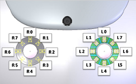

.. _msgs:

Nao msg files
#############

Accelerometer
*************

.. image:: /images/accelerometer.png

Units are in m/s :sup:`2`

Note that gravity is measured by an accelerometer.
When standing, the robot will measure 9.8 m/s :sup:`2` POSITIVE in the z-direction, since its 
receiving an acceleration upwards from the floor when compared to a freefall state.

.. code-block:: python

    float32 x  # m/s/s
    float32 y  # m/s/s
    float32 z  # m/s/s

Angle
*****

.. image:: /images/angle.png

Units are in rad.

.. code-block:: python

    float32 x  # rad
    float32 y  # rad

Battery
*******

.. code-block:: python

    float32 charge  # 0% - 100%
    bool charging  # True if robot is getting charged
    float32 current  # In Amperes, negative for discharge, positive for charge
    float32 temperature  # Celcius (°C)

Buttons
*******

.. code-block:: python

    bool chest  # true if being pressed
    bool l_foot_bumper_left  # true if being pressed
    bool l_foot_bumper_right  # true if being pressed
    bool r_foot_bumper_left  # true if being pressed
    bool r_foot_bumper_right  # true if being pressed

FSR
***

.. code-block:: python

    float32 l_foot_front_left  # kg
    float32 l_foot_front_right  # kg
    float32 l_foot_back_left  # kg
    float32 l_foot_back_right  # kg
    float32 r_foot_front_left  # kg
    float32 r_foot_front_right  # kg
    float32 r_foot_back_left  # kg
    float32 r_foot_back_right  # kg

Gyroscope
*********

.. image:: /images/gyroscope.png

Units are in rad/s.

.. code-block:: python

    float32 x  # rad/s
    float32 y  # rad/s
    float32 z  # rad/s

Joints
******

See :ref:`joint_indexes` to see which indexes correspond to which joint

.. code-block:: python

    float32[25] angles        # rad
    float32[25] stiffnesses   # 0.0 - 1.0
    float32[25] temperatures  # Celcius (°C)
    float32[25] currents      # Amperes (A)
    int32[25] statuses        # Temperature Status computed accordingly to the 
                              # temperature limitation to protecting the motor.
                              # 0: regular
                              # 1: high, start to reduce stiffness
                              # 2: very hot, stiffness reduced over 30%
                              # 3: critically hot, stiffness is set to 0

Sonar
*****

.. code-block:: python

    float32 left  # m
    float32 right  # m

Touch
*****

.. code-block:: python

    bool head_front  # true if being touched
    bool head_middle  # true if being touched
    bool head_rear  # true if being touched

RobotConfig
***********

.. code-block:: python

    string body_id  # eg."P0000073A07S94700012"
    string body_version  # eg. "6.0.0"
    string head_id  # eg. "P0000074A05S93M00061"
    string head_version  # eg. "6.0.0"

EyeLeds
*******

Message identifying colors for each of the 16 RGB Leds in the NAO's eyes. **Expected range for R, G and B are 0.0 - 1.0. The alpha (A) is not used.**

See :ref:`eye_led_indexes` to see which indexes correspond to which led in the eyes.

.. code-block:: python

    std_msgs/ColorRGBA[16] leds  # r, g, b should be 0.0 - 1.0. a is ignored